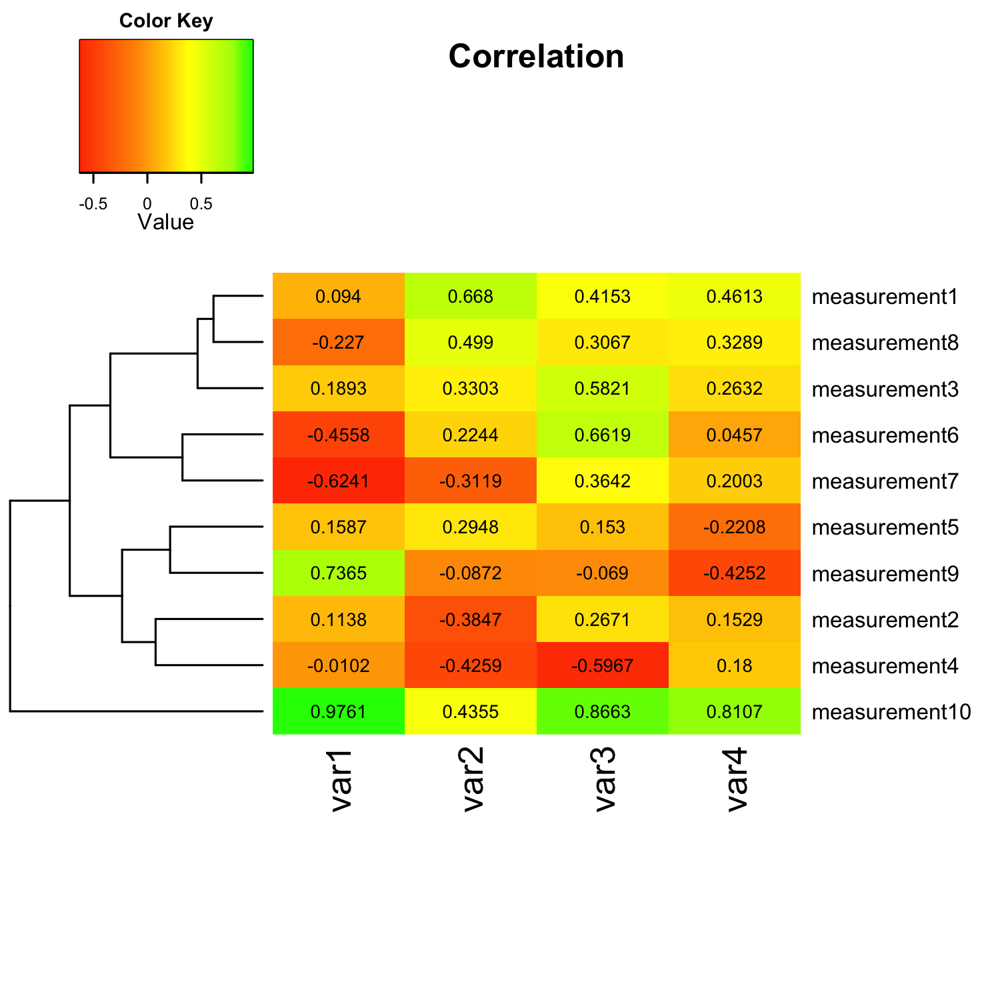
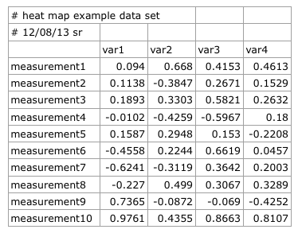

# A short tutorial for decent heat maps in R
I received many questions from people who want to quickly visualize their data via heat maps - ideally as quickly as possible. This is the major issue of exploratory data analysis, since we often don't have the time to digest whole books about the particular techniques in different software packages to just get the job done.
But once we are happy with our initial results, it might be worthwhile to dig deeper into the topic in order to further customize our plots and maybe even polish them for publication. In this post, my aim is to briefly introduce one of R's several heat map libraries for a simple data analysis.  
I chose R, because it is one of the most popular free statistical software packages around. Of course there are many more tools out there to produce similar results (and even in R there are many different packages for heat maps), but  I will leave this as an open topic for another time.  

####Sections
[Script overview](#script) 
[Running a script in R](#running_script) 
[Script parameters in more detail](#script_details) 
	&nbsp;&nbsp;&nbsp;&nbsp; [A) Installing and loading required packages](#installing) 
	&nbsp;&nbsp;&nbsp;&nbsp;[B) Reading in data and transform it into matrix format](#reading) 
	&nbsp;&nbsp;&nbsp;&nbsp;[C) Customizing and plotting the heat map](#customizing) 
		&nbsp;&nbsp;&nbsp;&nbsp;&nbsp;&nbsp;&nbsp;&nbsp;[Optional: Choosing custom color palettes and color breaks](#color) 
		&nbsp;&nbsp;&nbsp;&nbsp;&nbsp;&nbsp;&nbsp;&nbsp;[Optional: Saving the heat map as PNG file](#png) 
		&nbsp;&nbsp;&nbsp;&nbsp;&nbsp;&nbsp;&nbsp;&nbsp;[Plotting the heat map](#plotting) 

<b>The files that I used can be downloaded from here:</b> 
Example dataset: [heatmaps_in_r.csv](https://raw.github.com/rasbt/tutorials_cheatsheets/master/datasets/heatmaps_in_r.csv) 
R script: [heatmaps_in_r.R](https://raw.github.com/rasbt/tutorials_cheatsheets/master/scripts/heatmaps_in_r.R) 

Following this paragraph you see the whole shebang so that you know what you are dealing with: An R script that uses R's `gplot` package to create heat maps via the `heatmap.2()` function. It might look gargantuan considering that we "only" want to create a simple heat map, but don't worry, many of the parameters are not required, and I will discuss the details in the following sections.  

# Script overview

<blockquote>
<code>
	#########################################################
	### A) Installing and loading required packages
	#########################################################

	if (!require("gplots")) {
   		install.packages("gplots", dependencies = TRUE)
   		library(gplots)
   		}
	if (!require("gplots")) {
   		install.packages("RColorBrewer", dependencies = TRUE)
   		library(RColorBrewer)
   		}

	#########################################################
	### B) Reading in data and transform it into matrix format
	#########################################################

	data <- read.csv("../datasets/heatmaps_in_r.csv", comment.char="#")
	rnames <- data[,1]                            # assign labels in column 1 to "rnames"
	mat_data <- data.matrix(data[,2:ncol(data)])  # transform column 2-5 into a matrix
	rownames(mat_data) <- rnames                  # assign row names 

	#########################################################
	### C) Customizing and plotting the heat map
	#########################################################

	# creates a own color palette from red to green
	my_palette <- colorRampPalette(c("red", "yellow", "green"))(n = 299)

	# (optional) defines the color breaks manually for a "skewed" color transition
	col_breaks = c(seq(-1,0,length=100),  # for red
 	seq(0,0.8,length=100),              # for yellow
  	seq(0.8,1,length=100))              # for green

	# creates a 5 x 5 inch image
	png("../images/heatmaps_in_r.png",    # create PNG for the heat map        
  		width = 5*300,        # 5 x 300 pixels
  		height = 5*300,
  		res = 300,            # 300 pixels per inch
  		pointsize = 8)        # smaller font size

	heatmap.2(mat_data, 
  		cellnote = mat_data,  # same data set for cell labels
  		main = "Correlation", # heat map title
  		notecol="black",      # change font color of cell labels to black
  		density.info="none",  # turns off density plot inside color legend
  		trace="none",         # turns off trace lines inside the heat map
  		margins =c(12,9),     # widens margins around plot
  		col=my_palette,       # use on color palette defined earlier 
  		breaks=col_breaks,    # enable color transition at specified limits
  		dendrogram="row",     # only draw a row dendrogram
  		Colv="NA")            # turn off column clustering

	dev.off()               # close the PNG device
</code>
</blockquote>

[(download the script)](https://raw.github.com/rasbt/tutorials_cheatsheets/master/scripts/heatmaps_in_r.R)

# Running a script in R
To run a script in R, start  a new R session by either typing R into a shell terminal, or execute R from you Applications folder. Now, you can type the following command in R to execute a script:
<pre>source("path/to/the/script/heatmaps_in_R.R")</pre>

# Script parameters in more detail

### A) Installing and loading required packages
At first glance, this section might look a little bit more complicated then it need be, since executing `library(packagename)` is already sufficient to load required R packages if they are already installed.
<pre>
if (!require("gplots")) {
   install.packages("gplots", dependencies = TRUE)
   library(gplots)
   }
if (!require("gplots")) {
   install.packages("RColorBrewer", dependencies = TRUE)
   library(RColorBrewer)
   }
</pre>
The lines preceding the `library()` command are only there for convenience, to ensure that we will be prompted to install the required packages if we haven't set them up previously yet.  
We are importing the `gplot` package to call the function `heatmap.2()` as we will see in the later sections. There are a bunch of other options to create heat maps in R, such as R's basic `heatmap()` function and functions from the `ggplot2` package. I simply chose `heatmap.2()` here because it offers some nice extra features over R's in-built `heatmap()` function, such as a color legend, but follows the same familiar syntax.
The `RColorBrewer` package is more optional, and we will use it to make our own color palette for the heat map via the `colorRampPalette()` function.

### B) Reading in data and transform it into matrix format
We can feed in our data into R from many different data file formats, including ASCII formatted text files, Excel spreadsheets and so on. For this tutorial, we assume that our data is formatted as Comma-Separated Values (CSV); probably one of the most common data file formats.

When we open the CSV file in our favorite plain text editor instead of using a spread sheet program (Excel, Numbers, etc.), it looks like this:
<pre>
# heat map example data set,,,,
# 12/08/13 sr,,,,
,var1,var2,var3,var4
measurement1,0.094,0.668,0.4153,0.4613
measurement2,0.1138,-0.3847,0.2671,0.1529
measurement3,0.1893,0.3303,0.5821,0.2632
measurement4,-0.0102,-0.4259,-0.5967,0.18
measurement5,0.1587,0.2948,0.153,-0.2208
measurement6,-0.4558,0.2244,0.6619,0.0457
measurement7,-0.6241,-0.3119,0.3642,0.2003
measurement8,-0.227,0.499,0.3067,0.3289
measurement9,0.7365,-0.0872,-0.069,-0.4252
measurement10,0.9761,0.4355,0.8663,0.8107
</pre>
[(download the CSV file)](https://raw.github.com/rasbt/tutorials_cheatsheets/master/datasets/heatmaps_in_r.csv)

When we are reading the data from our CSV file into R and assign it to the variable `data`, note the two lines of comments preceding the main data in our CSV file, indicated by an octothorpe (#) character. Since we don't need those lines to plot our heat map, we can ignore them by via the `comment.char`  argument in the `read.csv()` function.
<pre>data <- read.csv("../datasets/heatmaps_in_r.csv", comment.char="#")</pre>

One tricky part of the `heatmap.2()` function is that it requires the data in a numerical matrix format in order to plot it.  By default, data that we read from files using R's `read.table()` or `read.csv()` functions is stored in a `data table` format. The `matrix` format differs from the `data table` format by the fact that a `matrix` can only hold one type of data, e.g., numerical, strings, or logical.  
Fortunately, we don't have to worry about the row that contains our column names (var1, var2, var3, var4) since the `read.csv()` function treats the first line of data as `table header` by default. But we would run into trouble if we want to include the row names (measurement1, measurment2, etc.) in our numerical matrix.   
For our own convenience, we store those row names in the first column as variable `rnames`, which we can use later to assign `row names` to our matrix after the conversion.
<pre> rnames <- data[,1]  </pre>

Now, we transform the numerical data from the variable `data` (column 2 to 5) into a matrix and assign it to a new variable `mat_data`
<pre>mat_data <- data.matrix(data[,2:ncol(data)])</pre>
Instead of using the rather fiddly expression `ncol(data)]`, which returns the total number of columns from the data table,  we could also provide the integer 5 directly in order to specify the last column that we want to include. However, `ncol(data)]` is more convenient for larger data sets so that we don't need to count all columns to get the index of the last column for specifying the upper boundary.  
Next, we assign the column names, which we have saved as `rnames` previously, to the matrix via
<pre>rownames(mat_data) <- rnames </pre>

### C) Customizing and plotting the heat map
Finally, we have our data in the "right" format in order to create our heat map, but before we get down to business, let us have a brief look at some options for customization.

#### Optional: Choosing custom color palettes and color breaks 

Instead of using the default colors of the `heatmap.2()` function, I want to show you how to use the `RColorBrewer` package for creating our own color palettes. Here, we go with the most popular choice for heat maps: A color range from green over yellow to red.
<pre>my_palette <- colorRampPalette(c("red", "yellow", "green"))(n = 299)</pre>
There are many different ways to specify colors in R. I find it most convenient to assign colors by their name. A nice overview of the different color names in R can be found at (http://www.stat.columbia.edu/~tzheng/files/Rcolor.pdf)[http://www.stat.columbia.edu/~tzheng/files/Rcolor.pdf]  

The argument `(n = 299)` lets us define how many individuals colors we want to have in our palette. Obviously, the higher the number of individual colors, the smoother the transition will be; the number 299 should be sufficiently large enough for a smooth transition.  
By default, RColorBrewer will divide the colors evenly so that every color in our palette will be an interval of individual colors of similar size. However, sometimes we want to have a little skewed color range depending on the data we are analyzing. 
Let's assume that our example data set consists of Pearson correlation coefficients (i.e., R values) ranging from -1 to 1, and we are particularly interested in samples that have a (relatively) high correlation: R values in the range between 0.8 to 1.0. We want to highlight these samples in our heat map by only showing values from 0.8 to 1 in green. In this case, we can define our color breaks "unevenly" by using the following code:
<pre>
col_breaks = c(seq(-1,0,length=100),  # for red
seq(0,0.8,length=100),              				# for yellow
seq(0.8,1,length=100))              				# for green
</pre>

#### Optional: Saving the heat map as PNG file
R supports a variety of different vector graphics formats, such as SVG, PostScript, and PDFs, and raster graphics (bitmaps) like JPEG, PNG, TIFF, BMP, etc. Each format comes with its own advantages and disadvantages, and depending on the particular purposes (websites, journal articles, PowerPoint presentations, archiving ... ) we chose one file format over the other.  
I don't want to discuss all the details about when to use which particular file format in this tutorial but instead use a more common PNG format for our heat map. I picked PNG instead of JPEG, because PNG offers lossless compression (JPEG is a lossy image format) at the small cost of a slightly larger file size.
However, you could completely omit the `png()` function in your script if you just want to show the heat map in an interactive screen in R.

<pre>
png("../images/heatmaps_in_r.png",    # create PNG for the heat map        
width = 5*300,        # 5 x 300 pixels
height = 5*300,
res = 300,            # 300 pixels per inch
pointsize = 8)        # smaller font size
</pre>

The default parameters of the `png()` function would yield a relatively small PNG file at very low resolution, which is not really practical for heat maps. Thus we provide additional arguments for the image `width`, `height` and the resolution.  
The units of `width` and `height` are pixels, not inches. So if we want to create a 5x5 inch image with 300 pixels per inch, we have to do a little math here: [1500 pixels] / [300 pixels/inch] = 5 inches. Also, we choose a slightly smaller font size of 8 pt.

<b>Be careful to not forget to close the `png()` plotting device at the end of you script via the function
<pre>dev.off()</pre>
otherwise you probably won't be able to open the PNG file to view it. </b>

#### Plotting the heat map

Now, let's get down to business and take a look at the `heatmap.2()` function:

<pre>
heatmap.2(mat_data, 
  cellnote = mat_data,  # same data set for cell labels
  main = "Correlation", # heat map title
  notecol="black",      # change font color of cell labels to black
  density.info="none",  # turns off density plot inside color legend
  trace="none",         # turns off trace lines inside the heat map
  margins =c(12,9),     # widens margins around plot
  col=my_palette,       # use on color palette defined earlier 
  breaks=col_breaks,    # enable color transition at specified limits
  dendrogram="row",     # only draw a row dendrogram
  Colv="NA")            # turn off column clustering
  </pre>
  
As you remember, the first argument is the variable `mat_data` contains our numerical matrix data, which we prepared from our data file.
This is the only argument that is required to plot a default heat map, all the other following lines are all optional. 
I recommend you to call the function `help(heatmap.2)` in R to get a detailed list of all available parameters we are using (and not using) in our `heatmap.2()` function.
I hope that the comments in the code behind the different arguments are sufficient to explain their purpose. However, the `cellnote` might require a few more words. Via the `cellnote` parameter, we can show the individual values of our data in the cells of the heat maps. This can be either the same data matrix, or we can use a different data matrix of equal dimensions (for example the coefficient of determination R^2)

If you have any questions or need more explanations, you are welcome to provide feedback in the comment section below.
  

