# Unit testing in Python - Why we want to make it a habit

####Sections
[Advantages of unit testing] (#advantages) 
[Main components a typical unit test] (#components) 
[The different unit test frameworks in Python] (#frameworks) 
[Installing py.test] (#installing) 
[A py.test example walkthrough] (#example) 
[Writing some code we want to test] (#testcode) 
[Creating a "test" file] (#testfile) 
[Testing edge cases and refining our code] (#edgecases) 

Let's be honest, code testing is everything but a joyful task. However, a good unit testing framework makes this process as smooth as possible. Eventually, testing becomes a regular and continuous process, accompanied by the assurance that our code will operate just as exact and seamlessly as a Swiss clockwork.

##Advantages of unit testing
Traditionally, for every piece of code we write (let it be a single function or class method), we would feed it some arbitrary inputs to make sure that it works the way we have expected.  And this might sound like a reasonable approach given that everything works as it should and if we do not plan to make any changes to the code until the end of days. Of course, this is rarely the case.  
Suppose we want to modify our code by refactoring it, or by tweaking it for improved efficiency: Do we really want to manually type the previous test cases all over again to make sure we didn't break anything? Or suppose we are planning to pass our code along to our co-workers: What reason do they have to trust it? How can we make their life easier by providing evidence that everything was tested and is supposed to work properly?   
Surely, no one wants to spend hours or even days of mundane work to test code that was inherited before it can be put to use in good conscience.  
There must be a cleverer way, an automated and more systematic approach...    
This is where unit tests come into play. Once we designed the interface (<em>here:</em> the in- and outputs of our functions and methods), we can write down several test cases and let them be checked every time we make changes to our code - without the tedious work of typing everything all over again, and without the risk of forgetting anything or by omitting crucial tests simply due to laziness.  
**This is especially important in scientific research, where your whole project depends on the correct analysis and assessment of any data - and there is probably no more convenient way to convince both you and the rightly skeptical reviewer that you just made a(nother) groundbreaking discovery.**

## Main components a typical unit test
In principle, unit testing is really no more than a more systematic way to automate code testing process. Where the term "unit" is typically defined as an isolated test case that consists of a the following components:  
- a so-called "fixture" (e.g., a function, a class or class method, or even a data file)  
- an action on the fixture (e.g., calling a function with a particular input)  
- an expected outcome (e.g., the expected return value of a function)  
- the actual outcome (e.g., the actual return value of a  function call)  
- a verification message (e.g., a report whether the actual return value matches the expected return value or not)  

## The different unit test frameworks in Python
In Python, we have the luxury to be able to choose from a variety of good and capable unit testing frameworks. Probably, the most popular and most widely used ones are:  
- the [unittest](http://docs.python.org/3.3/library/unittest.html) module - part of the Python Standard Library   
- [nose](https://nose.readthedocs.org/en/latest/index.html)  
- [py.test](http://pytest.org/latest/index.html)  
All of them work very well, and they are all sufficient for basic unit testing. Some people might prefer to use *nose* over the more "basic" *unittest* module. And many people are moving to the more recent *py.test* framework, since it offers some nice extensions and even more advanced and useful features. However,  it shall not be the focus of this tutorial to discuss all the details of the different unit testing frameworks and weight them against each other.
The screenshot below shows how the simple execution of *py.test* and *nose* may look like. To provide you with a little bit more background information: Both *nose* and *py.test* are crawling a subdirectory tree while looking for Python script files that start with the naming prefix "test". If those script files contain functions, classes, and class methods that also start with the prefix "test", the contained code will be executed by the unit testing frameworks.
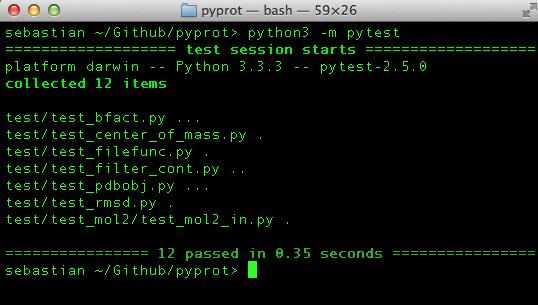

Command line syntax:  
`py.test <file or directory name>` - default unit testing with detailed report  
`py.test -q <file or directory name>` - default unit testing with summarized report (quiet mode)  
`nosetests` -  default unit testing with summarized report   
`nosetests -v` - default unit testing with detailed report (verbose mode)  

For the further sections of this tutorial, we will be using *py.test*, but everything is also compatible to the *nose* framework, and for the simple examples below it would not matter which framework we picked.  
However, there is one little difference in the default behavior, though, and it might also answer the question: "How does the framework know where to find the test code to execute?"  
By default, *py.test* descends into all subdirectories (from the current working directory or a particular folder that you provided as additional argument)  looking for Python scripts that start with the prefix "test". If there are functions, classes,  or class methods contained in these scripts that also start with the prefix "test", those will be executed by the unit testing framework. The basic behavior of *nose* is quite similar, but in contrast to browsing through all subdirectories, it will only consider those that start with the prefix "test" to look for the respective Python unit test code. Thus, it is a good habit to put all your test code under a directory starting with the prefix "test" even if you use *py.test* - your *nose* colleagues will thank you!  
The figure below shows how the *nose* and *py.test* unit test frameworks would descend the subdirectory tree looking for Python script files that start with the prefix "test".
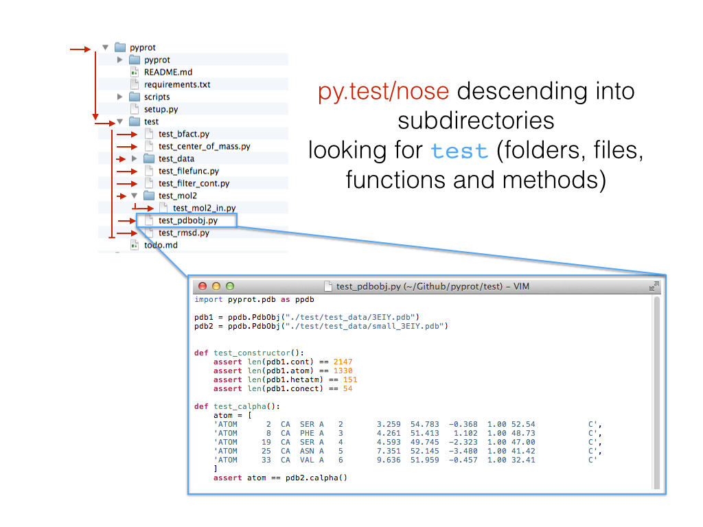

*Note: Interestingly,* nose *seems to be twice as fast as* py.test *in the example above, and I was curious if it is due to the fact that* py.test *searches all subdirectories (* nose *only searches those that start with "test"). Although there is a tiny speed difference when I specify the test code containing folder directly,* nose *still seems to be faster. However, I don't know how it scales, and it might be an interesting experiment to test for much larger projects.*

## Installing py.test
Installing py.test is pretty straightforward. We can install it directly from the command line via
<pre>pip install -U pytest </pre>
or 
<pre>easy_install -U pytest </pre>
If this doesn't work for you, you can visit the *py.test* website ((http://pytest.org/latest/) [py.test website]), download the package, and try to install it "manually": 
<pre>	~/Desktop/pytest-2.5.0> python3 setup.py install</pre>
If it was installed correctly, we can now run *py.test* in any directory from the command line via
<pre>	py.test	 \<file or directory\> </pre>
or 
<pre>	python -m pytest \<file or directory\></pre>

##A py.test example walkthrough
For the following example we will be using *py.test*, however, *nose* works pretty similarly, and as I mentioned in the previous section, I only want to focus on the essentials of unit testing here. Note that *py.test* has a lot of advanced and useful features to offer that we won't touch in this tutorial, e.g., setting break points for debugging, etc. (if you want to learn more, please take a look at the complete *py.test* documentation: [http://pytest.org/latest/contents.html#toc](http://pytest.org/latest/contents.html#toc)). 

### Writing some code we want to test 
Assume we wrote two very simple functions that we want to test, either as small scripts or part of a larger package. The first function, "multiple_of_three", is supposed to check whether a number is a multiple of the number 3 or not. We want the function to return the boolean value True if this is the case, and else it should return False. The second function, "filter_multiples_of_three", takes a list as input argument and is supposed to return a subset of the input list containing only those numbers that are multiples of 3.
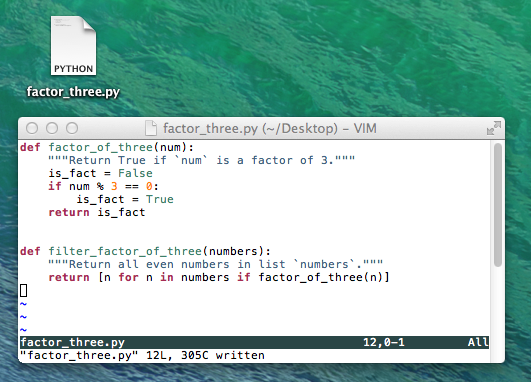

### Creating a "test" file
Next, we write a small unit test to check if our function works for some simple input cases:
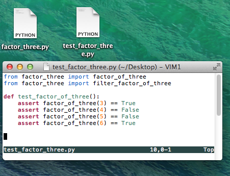
Great, when we run our py.test unit testing framework, we see that everything works as expected!
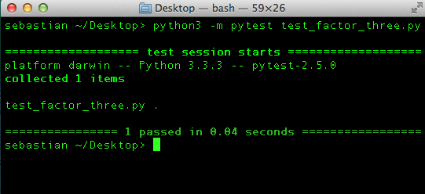
But what about edge cases?

### Testing edge cases and refining our code
In order to check if our function is yet robust enough to handle special cases, e.g., 0 as input, we extend our unit test code. Here, assume that we don't want 0 to evaluate to True, since we don't consider 3 to be a factor of 0.
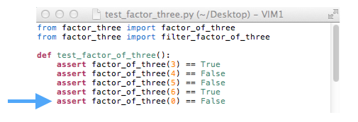

As you can see from the *py.test report*, our test just failed. So let us go back and fix our code to handle this special case.
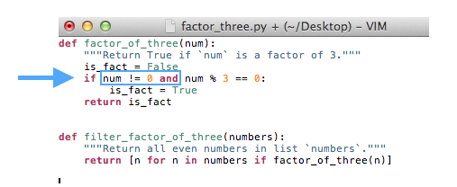
So far so good, when we execute *py.test* again (image not shown) we see that our codes handles 0 correctly now. Let us add some more edge cases: Negative integers, decimal floating-point numbers, and large integers.

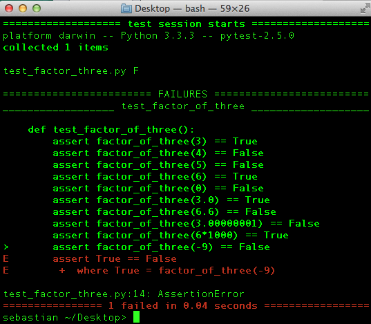

According to the unit test report, we face another problem here: Our code considers 3 as a factor of -9 (negative 9). For the sake of this example, let's assume that we don't want this to happen: We'd like to consider only positive numbers to be multiples of 3. In order to account for those cases, we need to make another small modification to our code by changing `!=0` to `>0` in the if-statement.
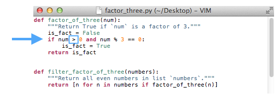

After running the *py.test* utility again, we are certain that our code can also handle negative numbers correctly now. And once we are satisfied with the general behavior of our current code, we can move on to testing the next function "filter_multiples_of_three", which depends on the correctness of "multiple_of_three".

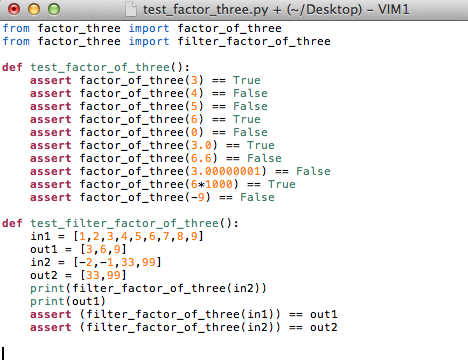
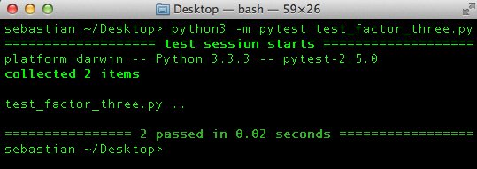

This time, our test seems to be "bug"-free, and we are confident that it can handle all the scenarios we could currently think of. If we plan to make any further modifications to the code in future, nothing can be more convenient to just re-run our previous tests in order to make sure that we didn't break anything.
